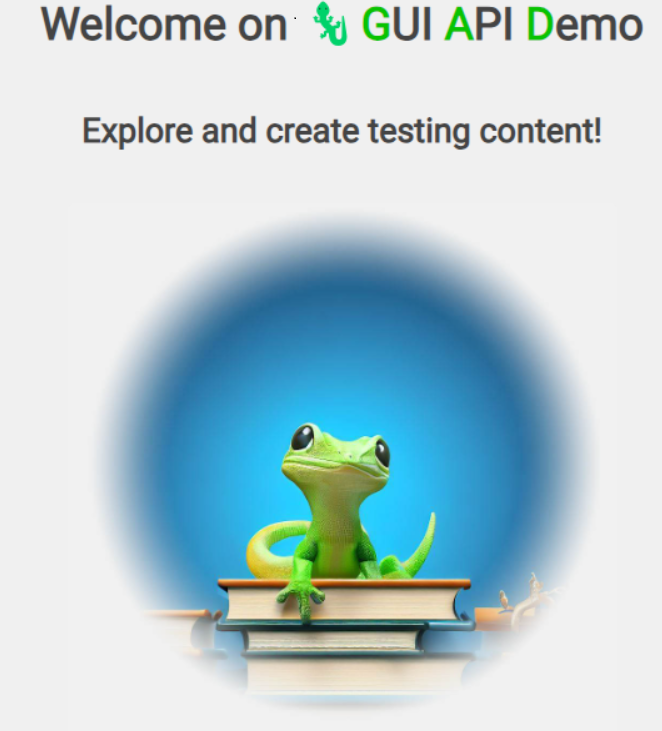
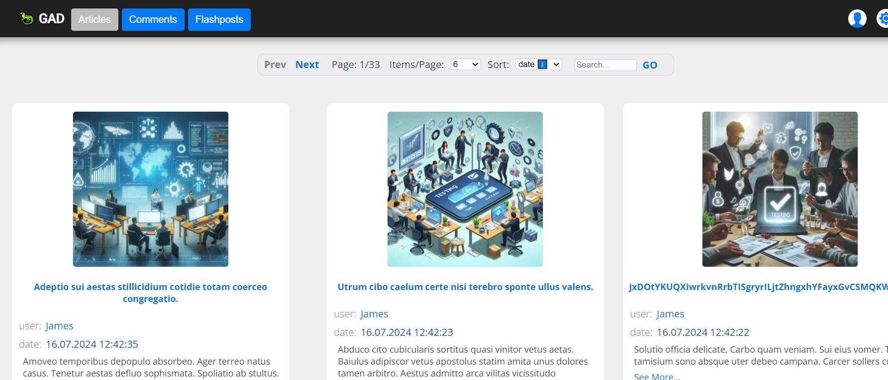

# Playwright test automation project

<!-- TABLE OF CONTENTS -->
 # Table of Contents
  
   1. [➤ About The Project](#about-the-project)
   2. [➤ Test application](#test-application)
   3. [➤ Prepare](#prepare)
   4. [➤ Running](#run)
   5. [➤ Requirements](#requirements)
   6. [➤ The Solution Architecture](#solution-architecture)
 


<!-- ABOUT THE PROJECT -->

# 📝 About The Project <a id="about-the-project"></a>

### A sample framework for automation E2E and API tests.
I have prepared several test cases to demonstrate the functionality and structure of the automation framework. My primary focus was on illustrating how to write and organize the tests, rather than on the actual testing of the application. I selected the GAD Test application, as it presents scenarios where even simple tests demand thoughtful and creative solutions.


<!-- TEST APPLICATION -->

# ☁️Test application <a id="overview"></a>

Note: This repository contains the core code of the GAD framework. If you want to build an application using GAD, visit the main  [GAD repository](https://github.com/jaktestowac/gad-gui-api-demo)

<p align="center"> 
  
</p>

**GAD** - Application for learning testing GUI and API. It provides:

- GUI - view of articles, comments, users
- API - complete documentation in Swagger
- TOOLS - database reset, database and resource preview

**Framework**
- Playwright
- Documentation
- Scripts

**Tools**
- VS Code
- Node.js
- GIT

<p align="center"> 
  
</p>


<!-- PREPARE -->

# 💾 Prepare <a id="prepare"></a>

### Local recommended tools:

- VS Code
- Git
- Node.js (version >16)

### Installation and setup

- (optional) install VSC recommended plugins
- install dependencies: `npm install`
- setup Playwright with: `npx playwright install --with-deps chromium`
- setup husky with: `npx husky install`
- prepare local env file: 'cp .env-template .env'
- copy application main URL as value of 'BASE_URL' variable in '.env' file


<!-- RUNNING -->

# 📜 Running <a id="run"></a>

Run all tests:

```
npx playwright test
```

Run all tests with tags:

```
npx playwright test --grep "@R01-01"
```

Run all tests without tags:

```
npx playwright test --grep-invert "@R01-01"
```

For more usage cases look in `package.json` scripts section.


<!-- GETTING STARTED -->
# ⭐ Requirements <a id="requirements"></a>

### Requirements R01

- R01-01: Home page title contains sentence 'GAD'
- R01-02: User can access without logging in to Articles and Comments pages
- R01-03: User can use menu buttons to navigate between Articles, Comments and Home page

### Requirements R02

- R02-01: User can login using login page

### Requirements R03

- R03-01: User can register to the service using required fields
- R03-02: Information about successful registration should be presented
- R03-03: After successful registration user is redirected to login page
- R03-04: When user provide incorrect email, message "Please provide a valid email address" is presented

### Requirements R04

- R04-01: User can create article with mandatory fields
- R04-02: Article title should not exceed 128 signs
- R04-03: User can access single article

### Requirements R05

- R05-01: Non logged user can access created article

### Requirements R06

- R06-01: User can use GO button and load articles even with empty search field
- R06-02: [Architecture] Articles page should use REST API for content source
- R06-03: [Architecture] Article data should be validated on backend (compatibility with coming: automatic title generation)
- R06-04: [Architecture] After creation of article - new article should be fetched from API
- R06-05: [Architecture] Comments data should be validated on backend (compatibility with coming: automatic body generation)
- R06-06: [Architecture] After creation of comment - new comment should be fetched from API

### Requirements R07

- R07-01: [Architecture] Articles can be returned by API for non logged users.
- R07-02: [Architecture] Comments can be returned by API for non logged users.

### Requirements R08

- R08-01: [Architecture] Articles can be created by API for logged users.
- R08-02: [Architecture] Comments can be created by API for logged users.
- R08-03: [Architecture] Articles can be deleted by API by logged users.
- R08-04: [Architecture] Comments can be deleted by API by logged users.


<!-- THE SOLUTION ARCHITECTURE -->
# 📖 The Solution Architecturerements <a id=solution-architecture> </a>


Updating Playwright
check if Playwright should be updated
```
npm outdated @playwright/test
```
update Playwright
```
npm i @playwright/test
```
update browsers
```
npx playwright install
```
verify Playwright version
```
npx @playwright/test --version
```


Extensions
- GitLens - view details of your repository i.e. commits history
- Prettier - default formatter for editor
- Playwright Test for VSCode - run and record tests form VSC

package.json example scripts
single command:
```
"test": "npx playwright test",
```
command with parameters:
```
"test:headed": "npx playwright test --headed",
```
other script with added parameters:
```
"test:pulpit:hd" : "npm run test tests/pulpit.spec.ts -- --headed"
```


Simple Page Object Model
Simple implementation of Page Object Model can be based on classes that represents and implements tested pages. Those classes contains locators of elements, that are used in tests, e.g. buttons, inputs etc.

Directory structure:
```
+-- Projects
|   +-- pages
|       +-- login.page.ts
|       +-- ...
|   +-- tests
|       +-- login.spac.ts
|       +-- ...
```